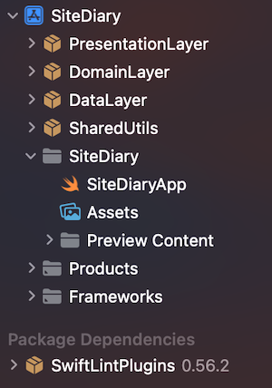
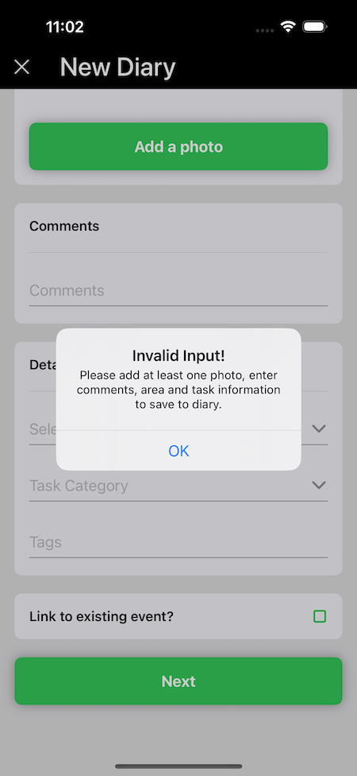

# 📔 SiteDiary App
A very simple app demonstrating **clean architecture**, **code organisation**, **loose coupling**, **unit testing**  and some of the best practices used in modern iOS programming using `Swift`, `SwiftUI`.

## 💡 API
To fake post the data, ReqRes.in api has been used.
For example: `POST https://reqres.in/api/diary/create` takes
attached http body as encoded JSON. In return it sends the same elements when succeeds as response body.
 

## 👨🏽‍💻 Solution Approach

> To break down the app layers and architecture as per best practice, I tried to resemble `Clean-Architecture` pattern which is very close to well known VIPER pattern. Actually, I adopted clean `MVVM` with integration to `UseCase` layer.

>> A good reference article here: [clean-architecture-swiftui](https://nalexn.github.io/clean-architecture-swiftui/) 

| Clean Architecture with MVVM |
| ---------------------------  |
|  |

The Codebase is broken down into 4 logical layers (via `Swift Packages`)
- `DataLayer`:
    - Network fetching of raw data and JSON decoding via URL, error code mapping etc.
- `DomainLayer`:
    - Business logic of fetching the weather data, query processing and management, relevant transformation, potential chaining of data sources to connect multiple remote services together
    - `UseCase`s live here (aka. `Interactor` in some codebases)
- `PresentationLayer`:
    - Domain data to SwiftUI binding logic
    - All UI specific code (SwiftUI)
- `SharedUtils`:
    - Common light weight utility helpers and extensions
- A mix of **`MVVM`** and **`VIPER`** design pattern is used to achieve loose coupling and unit testing via **`Dependency Injection`** patterns, spy & mocks
- Currently using Apple's `Combine` based `Reactive Binding`
- ✋🏽`TODO`: Migrate from `Combine` driven Publishers into `Swift`'s **Modern Concurrency Async Await** paradigm (probably `UseCase` can adopt this)
- `Unit Testing` is covered in each core layer's functionality & logic, except SwiftUI view's local logic
- Some TODO notes left in the code deliberately for potential improvements and SwiftLint warns us about those to trace them

The package dependencies (import logic from one to another) are shown below:

Please refer from the project navigator in Xcode to see the layering.

| Project  | Targets | Tests |
| ------ | -------- | ---- |
|   |     |     |

## 💻 Installation & Testing
 - `Xcode 15` or later (required)
 - Clean the `/DerivedData` folder if any
 - Let the Swift package Manager load and sync
 - Build the project and let the Swift Package Manager pulls the remote **`SwiftLint`** plugin
 - **iOS 17** minimum support for the app
 
 ## 🛠️ Use of Apple Frameworks
  - `SwiftUI`
  - `Combine`
  - No 3rd party libraries used

## Screenshots

| Screen 1 | Screen 2 | Screen 3 | Screen 4 | Screen 5 |
| ------ | ------ | ------ | ------ | ------ |
|   |   |  |  |  |

## ⛈️ Error Handling UX
- Custom error UI is shown when loading error occurs as Alerts
- `NetworkFailure` (i.e. internet disconnected) shows its custom message
- All other server errors have a generic message

